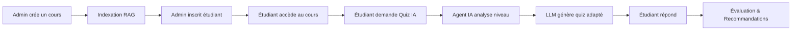

# 🎓 EduAI - Plateforme Éducative Intelligente

<div align="center">


**Une plateforme pédagogique moderne intégrant l'intelligence artificielle (LLM + RAG + Agent IA) pour une expérience d'apprentissage personnalisée et adaptative.**

[📋 Fonctionnalités](#-fonctionnalités) • [🚀 Installation](#-installation) • [🎯 Utilisation](#-utilisation) • [🛠 Technologies](#-technologies) • [🏗 Architecture](#-architecture)

---


</div>

## 📋 Description

EduAI est une plateforme éducative complète qui combine la gestion de cours traditionnelle avec des fonctionnalités d'IA avancées. Elle utilise une architecture **LLM + RAG + Agent IA** pour générer des quiz adaptatifs basés sur le contenu des cours et le niveau de chaque étudiant.

### 🌟 Points Forts

- 🤖 **IA Générative** - Quiz générés automatiquement par LLM
- 📊 **RAG (Retrieval-Augmented Generation)** - Indexation intelligente du contenu
- 🎯 **Agent IA Adaptatif** - Ajustement du niveau selon les performances
- 🔐 **Sécurité Robuste** - Authentification Spring Security
- 🎨 **Design Moderne** - Interface sombre et élégante

---

## ✨ Fonctionnalités

<table>
<tr>
<td width="50%">

### 👨‍💼 Espace Administrateur

- 📚 **Gestion des cours** 
  - Créer, modifier, supprimer des cours
  - Contenu multimédia (vidéos, PDF)
  - Publication et indexation RAG
  
- 👥 **Gestion des étudiants**
  - Inscription aux cours
  - Suivi des performances
  
- 📝 **Évaluations personnalisées**
  - Questions à choix multiples
  - Seuil de réussite configurable
  
- 📊 **Tableau de bord**
  - Statistiques globales
  - Vue d'ensemble

</td>
<td width="50%">

### 👨‍🎓 Espace Étudiant

- 🏠 **Dashboard personnalisé**
  - Progression en temps réel
  - Cours inscrits
  
- 📖 **Accès aux cours**
  - Contenu riche (texte, vidéo)
  - Documents téléchargeables
  
- 🤖 **Quiz IA Adaptatifs**
  - 3 niveaux de difficulté
  - Génération basée sur le contenu
  
- 🏆 **Suivi de progression**
  - Historique complet
  - Badges et réussites

</td>
</tr>
</table>

### 🧠 Intelligence Artificielle

```
┌─────────────────────────────────────────────────────────────────┐
│                        ARCHITECTURE IA                          │
├─────────────────────────────────────────────────────────────────┤
│                                                                 │
│   📄 Cours  ───►  🔍 RAG Indexation  ───►  📊 Chunks Vectorisés │
│                                                                 │
│   👤 Étudiant  ───►  🤖 Agent IA  ───►  📈 Analyse Niveau       │
│                                                                 │
│   🧠 LLM  ◄───  📝 Contexte RAG + Niveau  ───►  ❓ Quiz Adapté  │
│                                                                 │
└─────────────────────────────────────────────────────────────────┘
```

---

## 🚀 Installation

### Prérequis

| Outil | Version | Téléchargement |
|-------|---------|----------------|
| Java JDK | 17+ | [Oracle](https://www.oracle.com/java/technologies/downloads/) / [OpenJDK](https://openjdk.org/) |
| Maven | 3.8+ | [Apache Maven](https://maven.apache.org/download.cgi) |
| Git | Latest | [Git SCM](https://git-scm.com/) |

### 📥 Installation Rapide

```bash
# 1. Cloner le repository
git clone https://github.com/BGH-dev22/eduai-platform.git

# 2. Accéder au répertoire
cd eduai-platform

# 3. Configurer les clés API
cp application.properties.example src/main/resources/application.properties
# Puis éditez le fichier et ajoutez vos vraies clés API

# 4. Compiler le projet
mvn clean install

# 5. Lancer l'application
mvn spring-boot:run
```

### ⚠️ Configuration des Clés API

**IMPORTANT:** Le fichier `application.properties` contient des clés API sensibles et n'est pas inclus dans le repository.

1. Copiez le fichier exemple :
   ```bash
   cp application.properties.example src/main/resources/application.properties
   ```

2. Éditez `src/main/resources/application.properties` et remplacez :
   - `YOUR_OPENAI_API_KEY_HERE` par votre clé API OpenAI

3. **Ne committez JAMAIS** le fichier `application.properties` avec vos vraies clés !

### 🌐 Accès

Une fois l'application lancée, ouvrez votre navigateur :

```
http://localhost:8080
```

---

## 🎯 Utilisation

### 🔑 Comptes par Défaut

| Rôle | 👤 Utilisateur | 🔒 Mot de passe | Accès |
|------|----------------|-----------------|-------|
| **Admin** | `admin` | `admin123` | Gestion complète |
| **Étudiant** | `student` | `student123` | Cours et quiz |
| **Étudiant 2** | `jean.dupont` | `password123` | Cours et quiz |
| **Étudiant 3** | `marie.martin` | `password123` | Cours et quiz |

### 🗺️ Navigation

| Page | URL | Description |
|------|-----|-------------|
| 🔐 Connexion | `/login` | Page d'authentification |
| 👨‍💼 Admin Dashboard | `/admin/dashboard` | Tableau de bord admin |
| 📚 Gestion Cours | `/admin/courses` | Liste des cours |
| 👥 Gestion Étudiants | `/admin/students` | Liste des étudiants |
| 👨‍🎓 Étudiant Dashboard | `/student/dashboard` | Tableau de bord étudiant |
| 📖 Mes Cours | `/student/courses` | Cours de l'étudiant |
| 📋 Évaluations | `/student/evaluations` | Examens disponibles |
| 🗄️ Console H2 | `/h2-console` | Base de données |

### 📝 Workflow Type



---

## 🛠 Technologies

### Backend

| Technologie | Version | Rôle |
|-------------|---------|------|
|  | 17 | Langage principal |
|  | 3.2.0 | Framework web |
|  | 6.x | Authentification |
|  | 3.x | Persistance |
|  | 1.18.x | Réduction boilerplate |

### Frontend

| Technologie | Rôle |
|-------------|------|
|  | Moteur de templates |
|  | Design sombre moderne |
|  | Interactivité |

### Base de Données & IA

| Technologie | Rôle |
|-------------|------|
|  | BDD en mémoire (dev) |
|  | Intégration IA |
| OpenAI / Ollama | LLM pour génération |

---

## 🏗 Architecture

### Structure du Projet

```
📦 eduai-platform/
├── 📂 src/main/java/com/plateforme/educational/
│   ├── 📂 config/
│   │   └── 📄 DataInitializer.java      # Données initiales
│   │
│   ├── 📂 controller/
│   │   ├── 📄 MainController.java       # Authentification
│   │   ├── 📄 AdminController.java      # Gestion admin
│   │   └── 📄 StudentController.java    # Interface étudiant
│   │
│   ├── 📂 entity/
│   │   ├── 📄 User.java                 # Utilisateur
│   │   ├── 📄 Course.java               # Cours
│   │   ├── 📄 CourseChunk.java          # Fragments RAG
│   │   ├── 📄 Evaluation.java           # Évaluation
│   │   ├── 📄 EvaluationQuestion.java   # Question d'évaluation
│   │   ├── 📄 QuizAttempt.java          # Tentative de quiz
│   │   └── 📄 QuizQuestion.java         # Question de quiz
│   │
│   ├── 📂 repository/
│   │   └── 📄 *Repository.java          # Interfaces JPA
│   │
│   ├── 📂 security/
│   │   └── 📄 SecurityConfig.java       # Configuration sécurité
│   │
│   └── 📂 service/
│       ├── 📄 AIAgentService.java       # Agent IA adaptatif
│       ├── 📄 CourseService.java        # Logique cours
│       ├── 📄 EvaluationService.java    # Logique évaluations
│       └── 📄 UserService.java          # Logique utilisateurs
│
├── 📂 src/main/resources/
│   ├── 📂 templates/
│   │   ├── 📂 admin/                    # Pages administrateur
│   │   └── 📂 student/                  # Pages étudiant
│   ├── 📂 static/css/
│   │   └── 📄 style.css                 # Thème sombre
│   └── 📄 application.properties        # Configuration
│
└── 📂 uploads/                          # Fichiers uploadés
```

### Diagramme de Classes (Simplifié)

```
┌─────────────┐     ┌─────────────┐     ┌─────────────┐
│    User     │────►│   Course    │────►│ CourseChunk │
│  (Admin/    │     │             │     │   (RAG)     │
│  Student)   │     └─────────────┘     └─────────────┘
└─────────────┘            │
       │                   │
       │                   ▼
       │         ┌─────────────────┐
       │         │   Evaluation    │
       │         │                 │
       │         └────────┬────────┘
       │                  │
       ▼                  ▼
┌─────────────┐  ┌─────────────────┐
│ QuizAttempt │  │EvaluationQuestion│
│   (AI Gen)  │  │                 │
└─────────────┘  └─────────────────┘
```

---

## 🔧 Configuration

### Configuration IA (Optionnel)

Pour activer la génération IA avancée, modifiez `application.properties`:

```properties
# OpenAI (Cloud)
spring.ai.openai.api-key=sk-votre-cle-api
spring.ai.openai.chat.options.model=gpt-3.5-turbo

# OU Ollama (Local)
spring.ai.ollama.base-url=http://localhost:11434
spring.ai.ollama.chat.options.model=tinyllama:latest
```

### Configuration Base de Données

```properties
# H2 (Développement - par défaut)
spring.datasource.url=jdbc:h2:mem:educational_platform

# PostgreSQL (Production)
# spring.datasource.url=jdbc:postgresql://localhost:5432/eduai
# spring.datasource.username=postgres
# spring.datasource.password=password
```

---

## 🎨 Captures d'Écran

### Design Moderne avec Thème Sombre

L'interface utilise un design élégant avec :

- 🌙 **Thème sombre** - Confortable pour les yeux
- 🎨 **Dégradés modernes** - Violet/bleu/orange
- 📱 **Responsive** - Adapté mobile et desktop
- ✨ **Animations fluides** - Transitions CSS

---

## 🧪 Tests

```bash
# Exécuter les tests unitaires
mvn test

# Exécuter avec couverture
mvn test jacoco:report
```

---

## 🤝 Contribution

Les contributions sont les bienvenues !

1. 🍴 **Fork** le projet
2. 🌿 **Créer** une branche (`git checkout -b feature/NouvelleFonctionnalite`)
3. 💾 **Commit** vos changements (`git commit -m 'Ajout NouvelleFonctionnalite'`)
4. 📤 **Push** vers la branche (`git push origin feature/NouvelleFonctionnalite`)
5. 🔃 **Ouvrir** une Pull Request

---

## 📄 Licence

Ce projet est sous licence **MIT**. Voir le fichier [LICENSE](LICENSE) pour plus de détails.

---

## 👤 Auteur

**Votre Nom**

[](https://github.com/votreusername)
[](https://linkedin.com/in/votreprofil)

---

## 🙏 Remerciements

- [Spring Boot](https://spring.io/projects/spring-boot) - Framework backend
- [Thymeleaf](https://www.thymeleaf.org/) - Moteur de templates
- [Spring AI](https://spring.io/projects/spring-ai) - Intégration IA
- [OpenAI](https://openai.com/) - API LLM

---

<div align="center">

### ⭐ Si ce projet vous a été utile, n'hésitez pas à lui donner une étoile ! ⭐


**Made with ❤️ and ☕**

</div>
